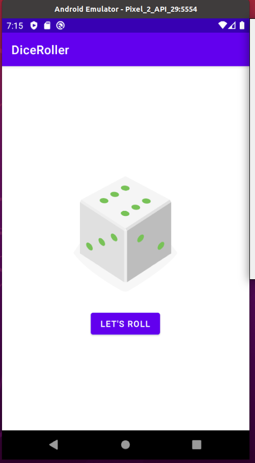

# kotlin-Dice-Roller

## Resources:
[Udacity Course](https://classroom.udacity.com/courses/ud9012/lessons/37a8fa57-7d18-4704-bfb7-da2864cb2e75/concepts/0fd1b0ee-e5e9-4b73-8dc2-85f77a7d7401)

## Code Source:
* [The visual code - Layouts](https://github.com/danyramirezg/kotlin-Dice-Roller/tree/master/app/src/main/res)
* [The Logic](https://github.com/danyramirezg/kotlin-Dice-Roller/blob/master/app/src/main/java/com/dany/diceroller/MainActivity.kt)

## Screenshots app:

## Author
* **Daniela Ramirez Gomez** - [danyramirezg](https://github.com/danyramirezg)
